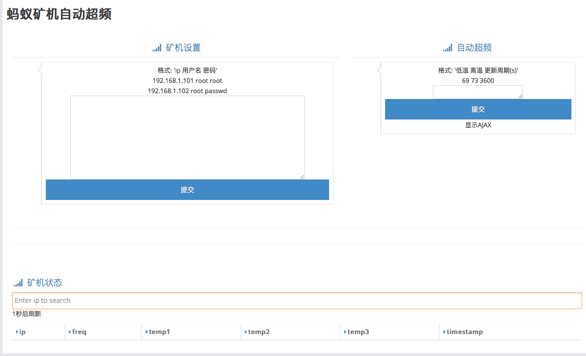

<h1>蚂蚁矿机自动超频</h1>

简介
=======
大部分蚂蚁BTC矿机需要手动调整频率，而通过网页可以获取到运行温度和当前运行频率，隔一段时间根据矿机温度调整运行频率可以更安全高效的挖BTC<br />
阿瓦隆矿机可以自动超频<br />
使用Django+BootStrap+AJAX做了一个简单的Web应用程序
稳定运行了几天的[日志](https://github.com/greatshi/antminer_auto_oc/blob/master/fig/log.txt)


使用
=======
安装[Anaconda2](https://www.anaconda.com/download/) <br />
之后命令行中运行: <br />
```Bash
pip install django==1.9.2
git clone https://github.com/greatshi/antminer_auto_oc.git
cd antminer_auto_oc
python manage.py runserver
```
<br />
浏览器打开 [http://127.0.0.1:8000/](http://127.0.0.1:8000/) 即可 <br />
首先提交矿机的ip 用户名 密码<br />
然后可以看到矿机信息<br />
然后设置温度，设置完成后点一次提交:<br />
<br />
使用之前在main()设置如下参数: <br />
需要自动超频的ip地址<br />
```Python
ips = ['192.168.1.101', '192.168.1.101']
```
矿机的用户名(username)和密码(password)<br />
低于这个温度增加频率<br />
```Python
low_temp = 69
```
高于这个温度降低频率<br />
```Python
high_temp = 73
```
调整频率的周期(s) <br />
```Python
term = 3600
```

之后安装python27<br />
执行<br />
```Bash
$python oc.py
```

Address
=======
欢迎用[币信钱包](https://web.bixin.im/webapp/)打赏<br />
BTC: 13iESTcV1sg1xL6ZSvhiE9Wf4GyzU5iRqL
